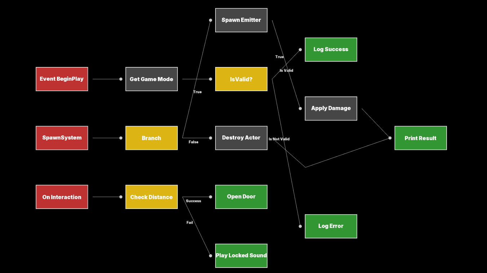

# BlueprintAutoLayout
A C++ tool that automatically calculates positions for graph nodes and visualizes them.
It is designed to take raw, unpositioned node data and arrange it into a readable, layered structure.

  
   
  <em>Generated Layout</em>

  ## How it works
   1. **CLI Input:** The program runs via command line, taking a path to a JSON file as an argument
   2. **Layout generation:** It processes the nodes and edges to calculate optimal $X$ and $Y$ coordinates using a layered approach.
   3. **Rendering:** Displays the result in a window using the **SFML** library.
   4. **Saving:** The final calculated layout is saved to resultLayout.json.

# Technical Stack
  - **Language:** C++20
  - **Graphics:** [SFML](https://www.sfml-dev.org/)
  - **JSON:** [nlohmann/json](https://github.com/nlohmann/json)

# Building
The project uses CMake for easy building on your own PC.
  ## Requirements
  - C++20
  - CMake
  - Git

  ## How To Build (for windows)
  1. Open cmd
  2. Navigate to where you want to clone your project (**cd C:/Projects**)
  3. Clone the repository (**git clone https://github.com/matheoheo/BlueprintAutoLayout.git**)
  4. Enter the project folder (**cd BlueprintAutoLayout**)
  5. Create build directory and navigate there(**mkdir build & cd build**)
  6. Configure the project (**cmake ..**)
  7. Compile the project (**cmake --build .**)
  8. Now you can navigate to proper directory and run example: (**cd Debug & BlueprintAutoLayout.exe assets/baseLayoutData.json**)

# How to run your file
To run algorithm on your file all you need to do is just run program from command line, and provide path to .json data as first argument:
``BlueprintAutoLayout.exe pathToYourData.json``

Result file will be saved in ``resultLayout.json`` file in the same folder that .exe file is.
